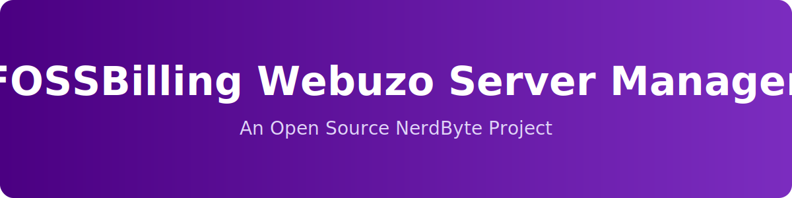

<!-- NerdByte Branding -->

  

  

  
  
  
  
  

---

## About This Project

FOSSBilling Webuzo Server Manager is an open source server management extension currently in development, designed to integrate Webuzo servers directly into the FOSSBilling platform.

The goal is to provide a clean, reliable, and maintainable way for hosting providers and developers to provision and manage Webuzo environments from within FOSSBilling.

The objective is to deliver a practical and extensible integration that can be relied upon in real hosting environments.

This repository will track development progress and eventually host the complete open source codebase.

---

## Current Status

The project is in early planning and architecture design.

Initial focus areas include:

- Webuzo server provisioning  
- Account lifecycle management  
- Automation within FOSSBilling workflows  
- Clean and extensible module structure  

A public roadmap will be published as development milestones are defined.

---

## Disclaimer

FOSSBilling Webuzo Server Manager is an independent project developed by NerdByte.

It is not affiliated with, endorsed by, or sponsored by:

- Webuzo  
- Softaculous  
- FOSSBilling  

All trademarks and product names are the property of their respective owners.

---

## Special Thanks

Special thanks to the Webuzo and Softaculous team for providing a developer license. Proper development and integration testing would not be possible without that support.

---

## License

This project will be released as open source. The final license will be announced prior to the first public release.

---

  <strong>NerdByte</strong> 
  Building tools for builders.

